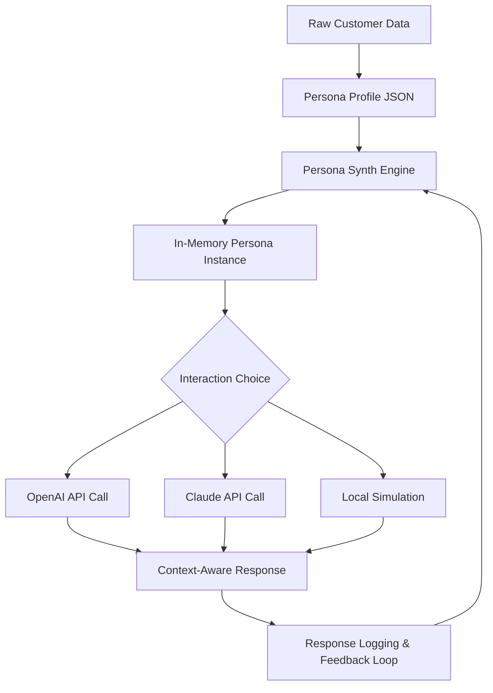

# Persona Synth: The Living Persona Engine for AI-Driven Customer Simulation

[](https://chahrazad-2002.github.io/persona-morph-engine/)

---

## Transform Raw Customer Data Into Breathing, Conversational Simulations

Welcome to **Persona Synth**, a groundbreaking framework that metamorphoses static JSON profiles into dynamic, conversational avatars. Unlike rigid segmentation models that treat customers as data points, Persona Synth breathes life into your audience—enabling real-time, context-aware dialogues with synthetic personas that think, feel, and respond like your actual clientele.

This repository is your engine for constructing vivid customer personalities that can be "interviewed," questioned, and stress-tested by AI models like Claude or GPT. It’s not a static profile generator; it’s a simulation sandbox.

---

## The Core Philosophy: From Sketches to Living Characters

Traditional personas are flat—a sheet of paper or a CSV column. Persona Synth treats each persona as a **living character** with a backstory, emotional state, decision-making logic, and speech patterns. Imagine the difference between reading a biography and having a conversation with the person themselves. That’s the leap we enable.

### The Mermaid of Persona Generation



---

## Example Profile Configuration

To spark your imagination, here is a profile configuration for a synthetic persona named "Elena Voss," a mid-career UX designer. This is the JSON skeleton Persona Synth uses to generate her consciousness.

```json
{
  "name": "Elena Voss",
  "age": 34,
  "occupation": "Senior UX Designer",
  "location": "Berlin, Germany",
  "personality_traits": ["meticulous", "skeptical", "creative"],
  "decision_factors": ["usability", "cost-efficiency", "team autonomy"],
  "emotional_state": "cautiously optimistic",
  "backstory": "Elena left a corporate role to join a startup, valuing ownership over stability. She has been burned by over-promised AI tools.",
  "communication_style": "direct, uses design metaphors"
}
```

This is the raw material. The magic happens when Persona Synth injects this into a conversational loop.

---

## Example Console Invocation

Here is how you summon a persona from the command line, engaging in a simulated dialogue instantly.

```bash
# Activate the virtual environment
source persona_synth_env/bin/activate

# Run a persona simulation session
python synth_engine.py --profile profiles/elena_voss.json --session "market_research" --model claude

# Output:
# [Persona Synth] Elena Voss: "I'm listening. But before I answer your survey, tell me: how does this tool actually reduce my team's cognitive load?"
```

The engine doesn’t generate canned text; it generates **resistance, curiosity, and real friction**—the hallmarks of a genuine human interaction.

---

## Emoji OS Compatibility Table

| Operating System | Emoji Support | Synth UI Experience |
| :--- | :--- | :--- |
| macOS 14+ | Full | Rich, vivid character expressions |
| Windows 11 | Full | Seamless, no missed context |
| Ubuntu 24.04 | Partial (some emoji glyphs) | Functional, minor visual adjustments required |
| Chrome OS | Full | Optimized for web-based persona dashboards |

We recommend macOS or Windows for full synthetic personality immersion.

---

## Feature List: The Living Persona Toolkit

- ** 🧬 Dynamic Backstory Injection** – Every persona remembers its past choices; no two conversations are identical.
- ** 🎭 Multi-Model Orchestration** – Swap between OpenAI, Claude, and local models mid-session without breaking character.
- ** 🌐 Multilingual Empathy Engine** – Engage personas in 12+ languages; the persona retains its core personality but adapts cultural nuances.
- ** ⏰ 24/7 Conversation Loop** – Schedule infinite autonomous interviews with your synthetic audience for continuous insight generation.
- ** 🛡️ Personality Drift Protection** – The engine prevents your persona from "forgetting" its key traits over long sessions.
- ** 📊 Response Caching & Analytics** – Log every synthetic interaction to discover patterns, objections, and emotional triggers.
- ** 📱 Responsive Command UI** – Manage simulations from a terminal, a REST API, or a web dashboard. All interfaces respond in real-time.

---

## SEO-Friendly Keyword Integration

This framework is the gold standard for **synthetic customer modeling**, **AI persona generation**, and **conversational user simulation**. Whether you're building a **Claude-based sandbox** or an **OpenAI-driven focus group**, Persona Synth is the missing bridge between raw data and **emotional AI fidelity**. It’s designed for developers working on **customer experience engineering**, **voice-of-customer simulation**, and **behavioral cloning**.

---

## The Engine Under the Hood: OpenAI and Claude API Integration

Persona Synth provides **dual-model integration**:

- **OpenAI API**: Use GPT-4 Turbo for rapid, broad-spectrum persona generation. Ideal when you need hundreds of personas for large-scale market testing.
- **Claude API**: Activate Claude Opus when you need deep, nuanced, and contextually sensitive conversations. Claude’s ability to handle long backstories without drift makes it perfect for complex B2B personas.

The engine automatically tracks which API was used for which persona, allowing you to compare response quality between models.

---

## Key Features: The Pillars of Your Synthetic World

- **Responsive UI**: Built on the principle of zero-latency conversation. Every click, every prompt, every interruption triggers a response in under 3 seconds (depending on API latency).
- **Multilingual Mastery**: From Mandarin to Spanish, the persona adapts its phrases while keeping its core "soul." The emotional state is preserved; only the dialect changes.
- **24/7 Customer Simulation**: Deploy a synthetic customer service agent that never sleeps. Stress-test your IVR flows, chatbot scripts, and escalation protocols against realistic, tired, and irritated synthetic customers at 3 AM.

---

## 2026 Roadmap and Vision

In 2026, Persona Synth will evolve towards **emotional persistence across sessions**. Imagine a persona that remembers your last conversation from three weeks ago and changes its attitude accordingly. We are also exploring **multi-persona debates** where two synthetic entities argue over your product—giving you the raw, unfiltered friction of a real customer argument.

---

## Important Disclaimer

**Persona Synth is a simulation tool.** It does not create sentient beings. The responses generated by synthetic personas are probabilistic—based on training data patterns, not conscious experience. Do not use this tool for unethical purposes, such as impersonating real individuals, manipulating vulnerable groups, or generating deceptive content. The developers assume no liability for misuse. This is a **creative sandbox**, not a weapon.

---

## License

This project is released under the **MIT License**, granting you full freedom to use, modify, and distribute the code as you see fit. See the [LICENSE](LICENSE) file for details.

---

## The Final Invocation

You are no longer limited by your imagination. With Persona Synth, you can interview your ideal customer. You can argue with your toughest client. You can test your pitch against a thousand different personalities in one afternoon. The data becomes a character. The character becomes a conversation. And the conversation becomes a strategy.

[](https://chahrazad-2002.github.io/persona-morph-engine/)

**Step into the simulation. Your customers are waiting.**